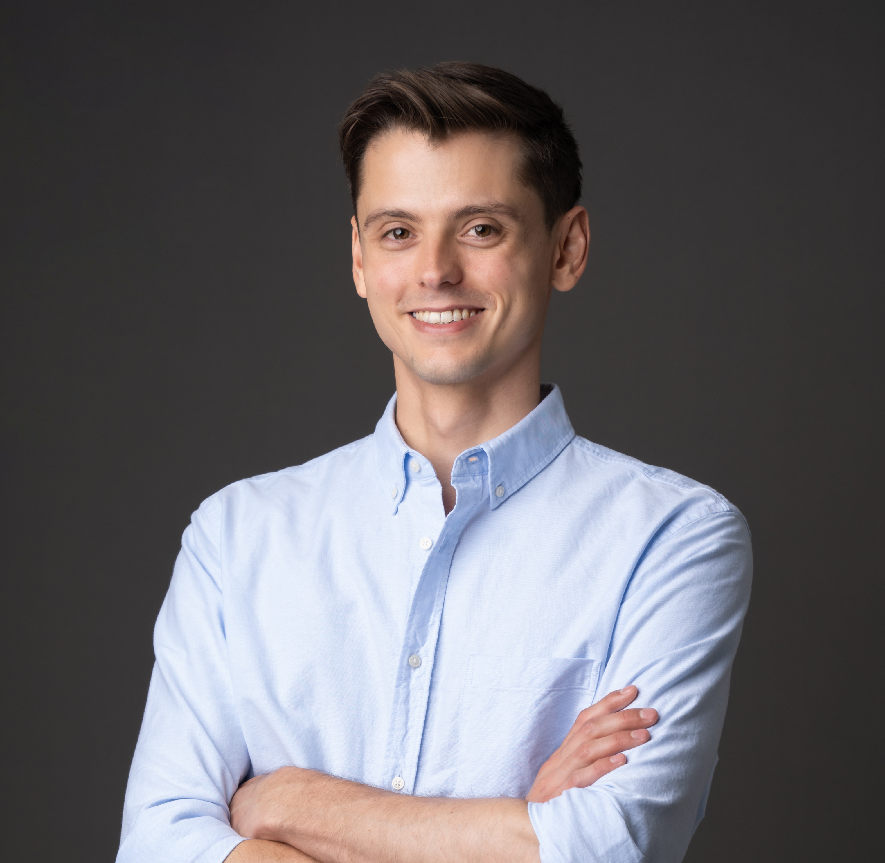

 
Hi, I'm Sebastian, an AI Engineer turned Web3 builder. I like building data products that help people lead better lives.

 

## Ubuntu Productivity Stack

Tools I use to stay productive:
* [Terminator](https://terminator-gtk3.readthedocs.io/en/latest/): A terminal emulator with easy arrangement of terminals in grid layouts and customizable shortcuts for splitting windows.
* [fzf](https://github.com/junegunn/fzf): Fuzzy search of the shell history, useful to repeat commands that have been typed before.
* [autojump](https://github.com/wting/autojump): Faster way to navigate the filesystem, remembers frequently used directories
* [fish](https://fishshell.com/): Alternative shell to bash and zsh with in-built autosuggestions, autocomplete, font highlighting. 
* [ulauncher](https://ulauncher.io/): An application launcher for Linux, similar to the Mac OS launchers Spotlight / Alfred / Raycast. Has a useful [plugin](https://ext.ulauncher.io/-/github-plibither8-ulauncher-vscode-recent) for quickly opening VSCode projects

## Background

Some positions I previously held:

* [appliedAI](https://www.appliedai.de/)          : Senior AI Engineer
* [italki](https://www.italki.com/en)             : Android Engineer

### Find me on Twitter

